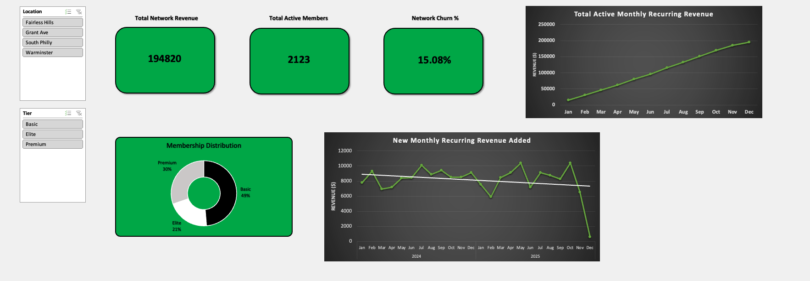
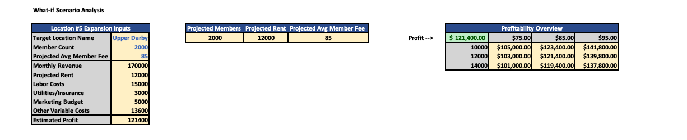

# Analytics-Portfolio# Multi-Location Fitness Operations Analytics & Expansion Model

An executive-level data analytics and financial modeling project designed to track key performance indicators (KPIs), evaluate member retention dynamics, and simulate capital allocation strategies for a multi-location fitness brand ("Fusion Gyms").

## 📊 Project Previews

### Executive KPI Dashboard

### Capital Allocation & Sensitivity Matrix

---

## 🚀 Key Features & Core Functionality

* **Cumulative MRR Growth Tracking:** Formulated a continuous time-series data pipeline tracing portfolio scale from $15K to $194K+ over a 24-month horizon. The logic accounts for structural subscription compounding and avoids seasonal calendar resets at year-end boundaries.
* **Granular Churn Analytics:** Integrated multi-variable interactive slicers allowing regional performance analysis across individual facilities (*Fairless Hills, Grant Ave, South Philly, Warminster*). Isolates total active rosters against member attrition velocity.
* **Predictive Capital Allocation Simulator:** Designed a dynamic "What-If" scenario matrix evaluating the financial feasibility of a 5th expansion facility (*Upper Darby*). Models overhead variance across a matrix of member capacities (1,000–3,000) and average dues structures ($75–$95) against fixed operating costs (Rent, Labor, Utilities, Marketing).

## 🛠️ Technical Stack & Methodology
* **Data Architecture:** Power Pivot, advanced logical array modeling, conditional validation formulas (`IF`, `VLOOKUP`, dynamic date groupings).
* **Analytics Framework:** Cohort-based member acquisition tracking, percentage churn isolation, and two-variable data table sensitivity matrices.
* **Data Origin:** Performance patterns and operational cost structures modeled utilizing realistic industry benchmarks typical of regional high-tier training hubs.

---

## 📂 How to Access and Navigate the Model
1. Download the `Fusion KPI Dashboard.xlsx` file from the repository root folder above.
2. Open the file in desktop Microsoft Excel and ensure content/macros are enabled to support the interactive slicing environment.
3. Use the **Location Slicers** on the dashboard tab to dynamically filter revenue, active memberships, and tier distributions across the portfolio.
4. Navigate to the **ExpansionSimulator** tab to modify baseline targets and observe real-time profit margin fluctuations in the sensitivity grid.
